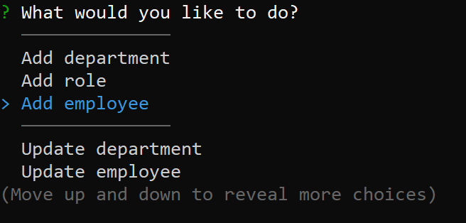
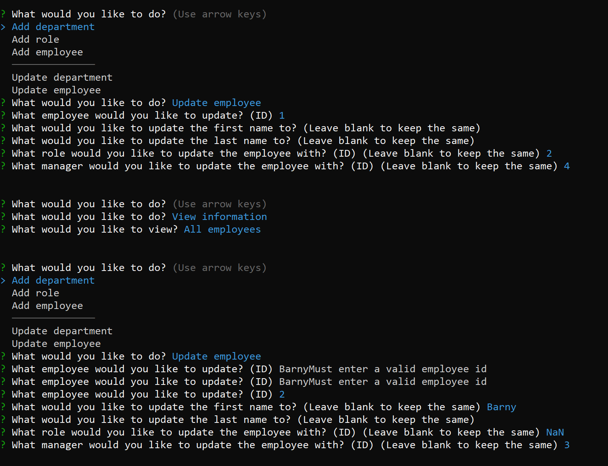
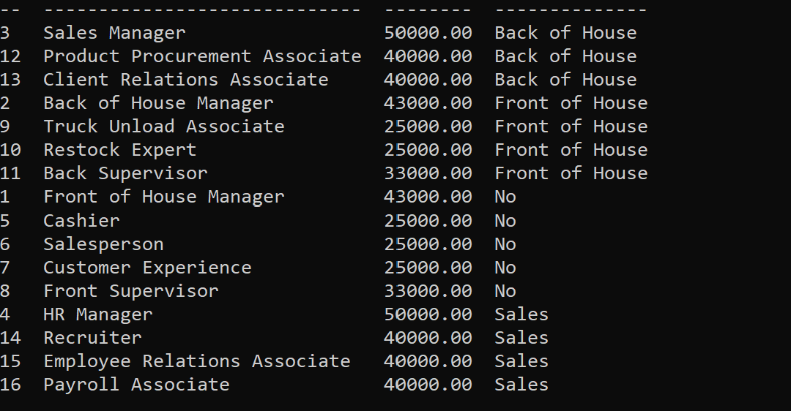

# Employee Tracker
Create, view, and manage a database of employees, departments and roles right from a cmd line! Uses SQL and Node.js to deliver a smooth experience and easy to manage.
<br><br>

## 🚚 Getting it up and running
** This requires SQL to be installed and set up first **
1. Clone the codebase from the [repo](https://github.com/mpityo/Employee-Tracker).
2. Query to the root file directory in any command prompt
3. Run the following command to install required packages:
```
npm install
```
4. Go to 'util/sql-connect.js.example' and remove the .example
5. Open the file and make changes to password and username to connect to your sql
6. Open sql through the cmd line:
```
mysql -u root -p
```
7. Run schema to create database and tables:
```
CREATE DATABASE store;
USE store;
SOURCE db/schema.sql;
quit;
```
8. Start the program and manage away:
```
node index
```
Want to see a walkthrough of the program? [Click here](https://drive.google.com/file/d/1HG-3mfHoWlTW-_nPOXKg-HU-SeIXsP--/view?usp=sharing) for a google drive display.

## :memo: Features
 - Powerful manager with the ability to add, update and delete any selected object
 - Reports to view a variety of different categories, including sorting employees by department and manager
 - No interaction directly with SQL needed, cmd prompt does all the dirty work for you
 - Full validation where needed, and checks where there isn't

 ## 🚧 TO-DO
 This is a MVP, always much to be upgraded/changed
 - Import information from database tables as selections for the user, instead of using ID numbers
 - Format tables better so column titles are directly overhead
 
## :trophy: Credit
Project idea by @UCFBootCampt
<br>
100% of code by yours truly, @mpityo
<br>
<br>
Project is fully open source: explore the code and upgrade away!
<br>
<br>




